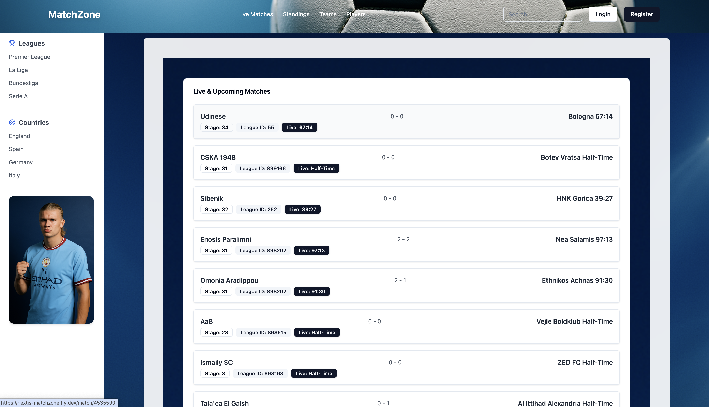

# MatchZone

MatchZone is a football platform designed for fans who want to explore live matches, teams, and players, powered by real-time data from a live football API.

## Live Demo

[Visit MatchZone](https://nextjs-matchzone.fly.dev/)

## Screenshot

.

## Disclaimer

Some functionalities of MatchZone depend on a third party Football API.  
In rare cases, if the API service is down or undergoing maintenance, live match data, standings, or player information may not be available or fully updated.  
Thank you for your understanding!

## technologies

- Next.js
- Tailwind
- shadncn/ui
- Postgres
- Jest
- Playwright
- Fly.io

## Database Setup

If you don't have PostgreSQL installed yet, follow the instructions from the PostgreSQL step in [UpLeveled's System Setup Instructions](https://github.com/upleveled/system-setup/blob/master/readme.md).

Copy the `.env.example` file to a new file called `.env` (ignored from Git) and fill in the necessary information.
Then, connect to the built-in `postgres` database as administrator in order to create the database:

### Windows

If it asks for a password, use `postgres`.

```bash
psql -U postgres
```

### macOS

```bash
psql -U postgres
```

### Linux

```bash
sudo -U postgres psql
```

Once you have connected, run the following to create the database:

```bash
CREATE DATABASE <database name>;
CREATE USER <user name> WITH ENCRYPTED PASSWORD '<user password>';
GRANT ALL PRIVILEGES ON DATABASE <database name> TO <user name>;
\connect <database name>
CREATE SCHEMA <schema name> AUTHORIZATION <user name>;
```

Quit psql using the following command:

```bash
\q
```

## Getting Started

First, run the development server:

```bash
npm run dev
# or
yarn dev
# or
pnpm dev
# or
bun dev
```

## tests

### Jest

```bash
pnpm jest
```

## Playwright

```bash
pnpm playwright test
```

## Deployment

Deployed the project on Fly.io
